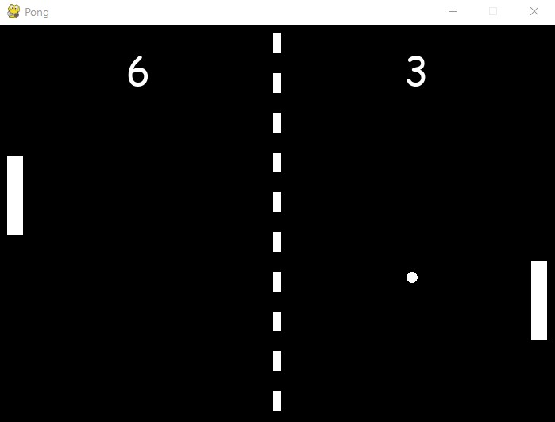

# 🏓 Pong Game in Python

🇺🇸 Simple Pong game built with Python and Pygame for learning game development basics with Pygame.

🇫🇷 Un jeu Pong simple développé avec Python et Pygame, conçu pour apprendre les bases du développement de jeux avec Pygame.

---

## 📸 Pong Game Preview



---

## 🎮 Controls / Contrôles

-   **Left Player / Joueur gauche** :  
    `S` (Up / Haut), `W` (Down / Bas)
-   **Right Player / Joueur droit** :  
    `↑` (Up / Haut), `↓` (Down / Bas)

🧠 🇺🇸 Note: Default controls are for AZERTY keyboards. Adjust `main.py` if you’re using QWERTY.

💡 🇫🇷 Remarque : Les contrôles par défaut sont pour claviers AZERTY. Adaptez `main.py` si vous utilisez QWERTY.

---

## 🛠 Requirements / Pré-requis

-   Python 3.x
-   Pygame → `pip install pygame`

---

## 🚀 How to Play / Lancer le jeu

🇺🇸 Clone the repository and run the game:  
🇫🇷 Clonez le dépôt et lancez le jeu :

```bash
git clone https://github.com/ton-pseudo/pong-game.git
cd pong-game
python main.py
```
